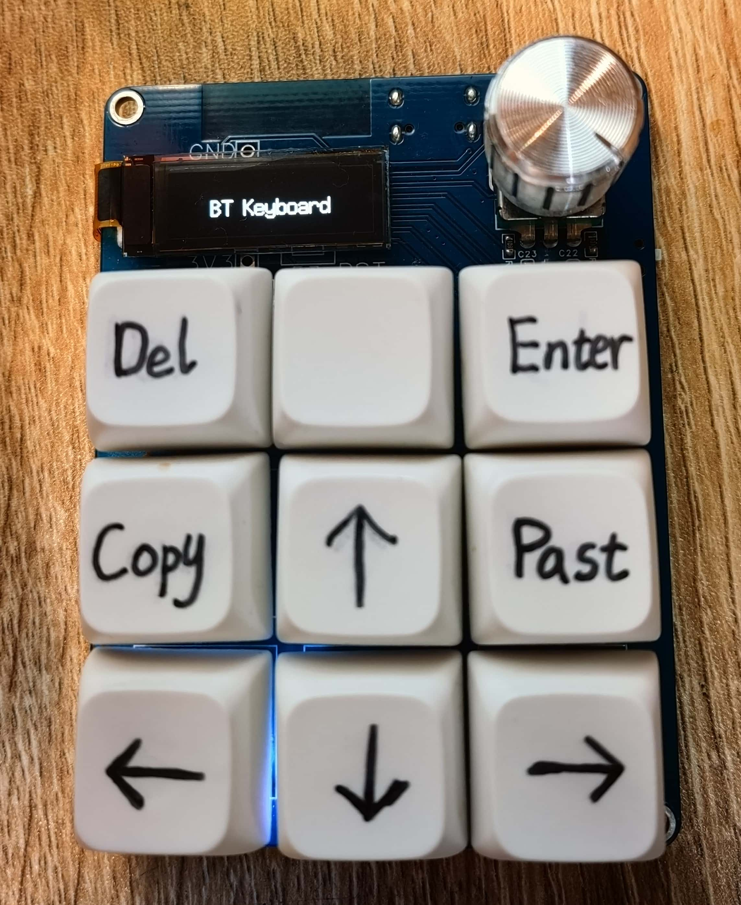

# PortableBlueToothKeyBoard
基于ESP32S3的9键蓝牙键盘，有蓝牙和有线两种模式，可以从C口直接编程和供电，带有自动休眠功能，一段时间内无人使用就自动降低中断处理频率或进入休眠模式以节省电量。

## 外观


## 硬件框架
**ESP32S3模组**
* 提供蓝牙连接核心功能
* 通过通用GPIO连接键盘阵列和旋转编码器

**锂电池充放电管理电路**
* TP4056锂电池充电芯片
* 电源自动切换电路
  * AO3415 PMOS
  * SS14低压降二极管
 
**LDO线性稳压电路**
* XC6219B332MR 3.3V线性降压芯片，压降低可兼容锂电池电压

**青轴按键阵列**
* 10K上拉电阻与100nF消抖电容
* 时间常数t=1ms，可有效抑制按键产生的高频抖动，同时又不至于让按键弹起的上升沿过慢提高按键延迟

**旋转式编码器**
* 通过AB两相下降沿的先后判断正反转
* 10K上拉与100nF消抖电容，有效消减触点抖动

**OLED显示屏**
* 1uF升压电容
* 4.7K I2C通讯协议上拉电阻

## 软件框架
```cpp
main.cpp  //初始化代码，主循环
```

